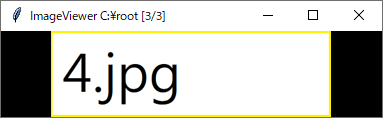
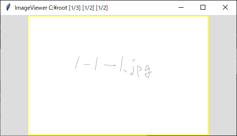

# TL Image Viewer
This is an Image Viewer developed using the Python TK package with the goal of providing a user-friendly way to view pictures, particularly when dealing with multiple folders. With this tool, you can efficiently navigate through pictures up to three levels deep using keyboard shortcuts.

# Config
template_config.yaml:
```
# modify the directory_config, and rename this config to config.yaml

window_config:
    width: 1024
    height: 768
directory_config:
    directory1: -
    directory2: -
    directory3: -
    directory4: -
    directory5: -
    directory6: -
    init_dir: -
available_extension: 
 - BMP
 - ICO
 - JPEG
 - jpg
 - png
 - jfif
 - webp
 - BLP
 - BMP
 - tiff
threads: 4
```
"The 'template_config.yaml' file includes settings for the image viewer. To customize your configuration, modify the 'directory_config' section by replacing the dashes with paths to your desired directories. If you don't need to specify many directories, you can simply set the 'init_dir' parameter to the directory you want to open by default, without modifying the other 'directory*'.

This file also specifies the list of supported image file extensions under the 'available_extension' parameter, and sets the 'threads' parameter to control the number of threads used for image processing.

After you've updated the configuration and renamed the file, you can launch the image viewer with your custom settings.
# Shortcuts


The keyboard shortcuts are optimized to allow you to navigate through pictures using primarily the right side of the keyboard.


## Navigation keys
When browsing through a folder tree structure like the one shown below:
```
\ROOT
│  4.jpg
│
├─folder1
│  │  1-2.jpg
│  │
│  └─folder1-1
│          1-1-1.jpg
│          1-1-2.jpg
│
└─folder2
        2-1.jpg
```

You can use the following keyboard shortcuts:

- Press `YUIO` to navigate through Layer 1 files and folders, including `4.jpg`, `folder1`, and `folder2`.

- Use `HJKL` to navigate through Layer 2 files and folders when Layer 1 is a folder, such as `1-2.jpg` and `folder1-1` inside Layer1 `folder1`, and `2-1.jpg` inside Layer1 `folder2`.

- Press `NM,.` to navigate through Layer 3 files and folders when Layer 2 is a folder, such as `1-1-1.jpg` and `1-1-2.jpg` inside Layer2 `folder1-1`.

- Use `78` for random access to files and folders inside Layers 1 and 2."

## Command Keys

You can use the keyboard shortcuts `\{COMMAND}`, `\\{COMMAND}`, and `\\\{COMMAND}` to apply a COMMAND to Layer 1, Layer 2, and Layer 3, respectively.

Currently, the available COMMANDs are limited to `SORT DATE` and `SORT NAME`, which can be used to set the default sorting method to either last modified date or filename.
## Jump Keys

To quickly navigate to a specific file in Layer 1, Layer 2, or Layer 3, you can use the keyboard shortcuts `;{NUM}`, `;;{NUM}`, and `;;;{NUM}`, respectively. These will take you to the NUM-th file in the corresponding layer.
## Search Keys

You can use the keyboard shortcuts `/{KEY}`, `//{KEY}`, and `///{KEY}` to search for the name of the first file or folder that starts with KEY in Layer 1, Layer 2, or Layer 3, respectively."

After entering the `Command Key`, `Jump Key`, `Search Key` mentioned above, you should press the `Enter` key to apply the command.
# Background Color
We set three kind of background colors for indicating which layer is the image at.

`Black` means that's the Layer1 image, you cannot navigate with `HJKL` and `NM,.` but `YUIO`.


`White` means that's the Layer2 image, you cannot navigate with `NM,.` but `YUIO` and `HJKL`.


`Gray` means that's the Layer3 image, you can navigate with `YUIO`, `HJKL` and `NM,.`



# Known Bugs
1. The program searches for images of each file/folder in Layer1. When you first start the program, the search process may not have completed yet. As a result, you may encounter a bug when accessing an incomplete file/folder.

# Contribution
We're open to ideas and contributions for this project, and we welcome anyone who would like to get involved. If you're interested in contributing, please feel free to create an issue or submit a pull request.