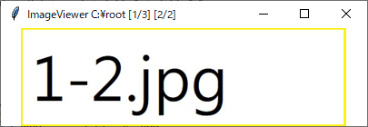
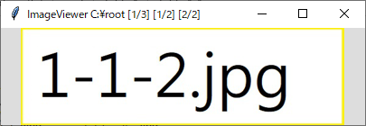

# TL Image Viewer
This is an Image Viewer developed using the Python TK package with the goal of providing a user-friendly way to view pictures, particularly when viewing through multiple folders. With this tool, you can efficiently navigate through pictures up to three levels deep using keyboard shortcuts.

# Usage
We have released a executable file for Windows, or you can run this program by:
```
pip install -r requirement.txt
python viewer.py
```

# Config
template_config.yaml:
```
# modify the directory_config, and rename this config to config.yaml

window_config:
    width: 1024
    height: 768
directory_config:
    directory1: -
    directory2: -
    directory3: -
    directory4: -
    directory5: -
    directory6: -
    init_dir: -
available_extension: 
 - BMP
 - ICO
 - JPEG
 - jpg
 - png
 - jfif
 - webp
 - BLP
 - BMP
 - tiff
threads: 4
```
The 'template_config.yaml' file includes settings for the image viewer. To customize your configuration, modify the 'directory_config' section by replacing the dashes with paths to your desired directories. If you don't need to specify many directories, you can simply set the 'init_dir' parameter to the directory you want to open by default, without modifying the other 'directory*'.

This file also specifies the list of supported image file extensions under the 'available_extension' parameter, and sets the 'threads' parameter to control the number of threads used for image processing.

After you've updated the configuration and renamed the file, you can launch the image viewer with your custom settings.
# Shortcuts


The keyboard shortcuts are optimized to allow you to navigate through pictures using primarily the right side of the keyboard.


## Navigation keys
When browsing through a folder tree structure like the one shown below:
```
\ROOT
│  3.jpg
│
├─folder1
│  │  1-2.jpg
│  │
│  └─folder1-1
│          1-1-1.jpg
│          1-1-2.jpg
│
└─folder2
        2-1.jpg
```

You can use the following keyboard shortcuts:

- Press `YUIO` to navigate through Depth1 files and folders, including `4.jpg`, `folder1`, and `folder2`.

- Use `HJKL` to navigate through Depth2 files and folders when Depth1 is a folder, such as `1-2.jpg` and `folder1-1` inside Depth1 `folder1`, and `2-1.jpg` inside Depth1 `folder2`.

- Press `NM,.` to navigate through Depth3 files and folders when Depth2 is a folder, such as `1-1-1.jpg` and `1-1-2.jpg` inside Depth2 `folder1-1`.

- Use `78` for random access to files and folders inside Depth1 and Depth2."

## Command Keys

You can use the keyboard shortcuts `\{COMMAND}`, `\\{COMMAND}`, and `\\\{COMMAND}` to apply a COMMAND to Depth 1, Depth 2, and Depth 3, respectively.

Currently, the available COMMANDs are limited to `SORT DATE` and `SORT NAME`, which can be used to set the default sorting method to either last modified date or filename. Default is `SORT DATE` for all Depths.
## Jump Keys

To quickly navigate to a specific file in Depth 1, Depth 2, or Depth 3, you can use the keyboard shortcuts `;{NUM}`, `;;{NUM}`, and `;;;{NUM}`, respectively. These will take you to the NUM-th file in the corresponding Depth.
## Search Keys

You can use the keyboard shortcuts `/{KEY}`, `//{KEY}`, and `///{KEY}` to search for the name of the first file or folder that starts with KEY in Depth 1, Depth 2, or Depth 3, respectively."

After entering the `Command Key`, `Jump Key`, `Search Key` mentioned above, you should press the `Enter` key to apply the command.

# Information from UI
We can observe from the Title and the Background Color to know what's the image index and what keys we can use to navigate through folder trees.

## Depth1 Image
`[3/3]` means the thrid item at Depth 1. 
`Black` background color indicates that's the Depth1 image, you cannot navigate with `HJKL` and `NM,.` but `YUIO`.


## Depth2 Image
`[1/3] [2/2]` means the second item in the first folder in Depth1. 
`White` background color indicates that's the Depth2 image, you cannot navigate with `NM,.` but `YUIO` and `HJKL`.



## Depth3 Image
`[1/3] [1/2] [2/2]` means the second item in the first folder in Depth1 and the first folder in Depth2.
`Gray` means that's the Depth3 image, you can navigate with `YUIO`, `HJKL` and `NM,.`



Note that if there's only one item in the Depth1 folder, it will be counted as Depth1 image, and there's only one item in the Depth2 folder, it will be counted as Depth2 image or Depth1 image.

# Known Issues
1. The program searches for images of each file/folder in Depth1. When you first start the program, the search process may not have completed yet. As a result, you may encounter a bug when accessing an incomplete file/folder.
2. Despite some effort to deal with empty folders, it would still cause bugs.

# Contribution
We're open to ideas and contributions for this project, and we welcome anyone who would like to get involved. If you're interested in contributing, please feel free to create an issue or submit a pull request.